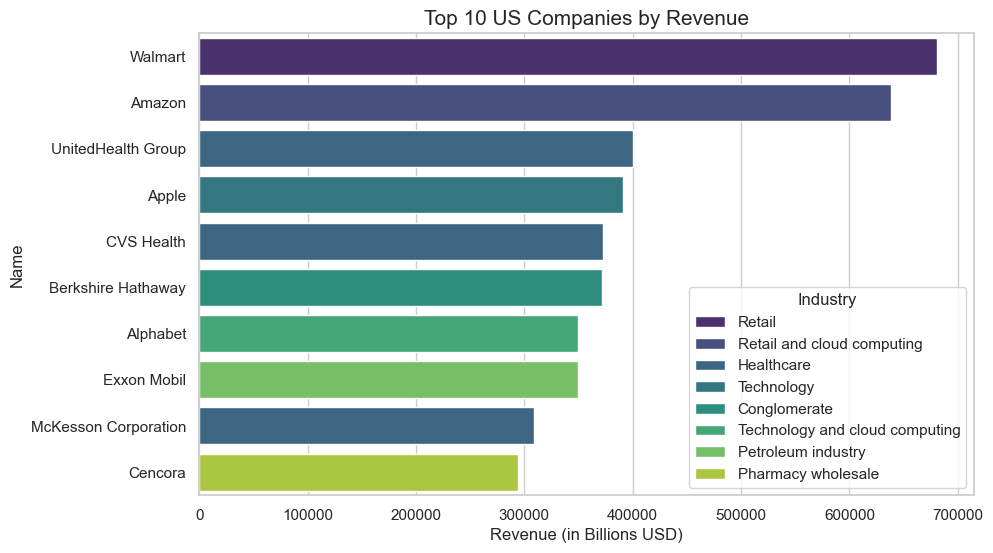
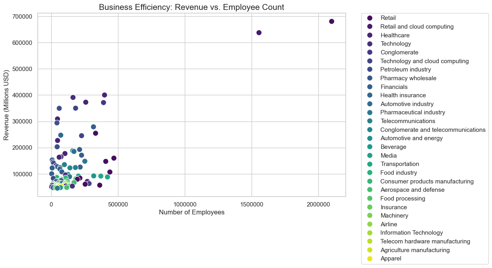
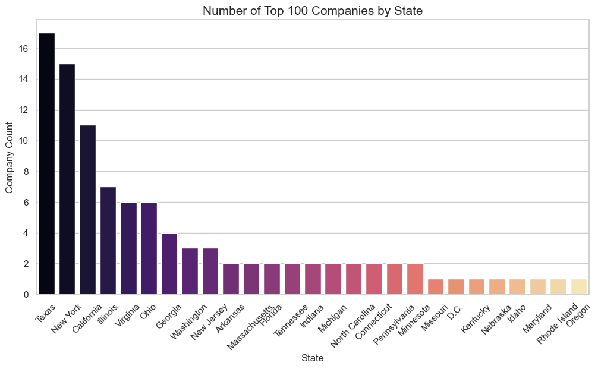

# 📈 US Top 100 Companies: Revenue & Efficiency Analysis

## 📌 Project Overview
This project involves **web scraping** the list of the largest companies in the United States by revenue from Wikipedia. The goal was to transform messy web data into a clean dataset for **Exploratory Data Analysis (EDA)** to understand industry trends, geographic distribution, and corporate efficiency.

## 🛠️ Tools Used
* **Python** (Requests & BeautifulSoup) for web scraping.
* **Pandas** for data cleaning (handling footnotes, currency conversion, and data types).
* **Seaborn & Matplotlib** for data visualization.

## 🧹 Data Cleaning Process
The raw data from Wikipedia required several cleaning steps:
1.  **Removing Footnotes:** Used Regex to strip Wikipedia citations like `[1]` or `[a]`.
2.  **Numeric Conversion:** Converted strings with commas and dollar signs (e.g., `$611,289`) into floats for mathematical analysis.
3.  **Handling Percentages:** Stripped `%` symbols from revenue growth columns.
4.  **Feature Engineering:** Extracted the **State** from the `Headquarters` column to analyze regional economic power.

## 📊 Key Visualizations

### 1. Top 10 Largest US Companies by Revenue
The "Heavy Hitters" of the US economy, led by Retail and Healthcare giants.

> **Insight:** The top of the list is dominated by consumer-facing giants like Walmart and Amazon, highlighting the massive scale of the US retail and logistics sectors.

### 2. Business Efficiency (Revenue vs. Employee Count)
This scatter plot highlights how different industries utilize their workforce.

> **Insight:** While Walmart and Amazon lead in total revenue, they require a workforce nearly 10x larger than high-efficiency sectors like Technology (Apple) or Healthcare (UnitedHealth Group).

### 3. Geographic Distribution of Headquarters
Which states host the most corporate power?

> **Insight:** Corporate headquarters are highly concentrated in specific hubs, with **Texas**, **New York**, and **California** leading the count.

## 🏁 Conclusion
The analysis shows a clear divide in the Top 100: high-volume retail giants with massive workforces versus high-margin technology and healthcare firms. Geographically, corporate power remains concentrated in coastal and tax-friendly hubs.

---
*Developed as part of my Data Analytics Portfolio.*
